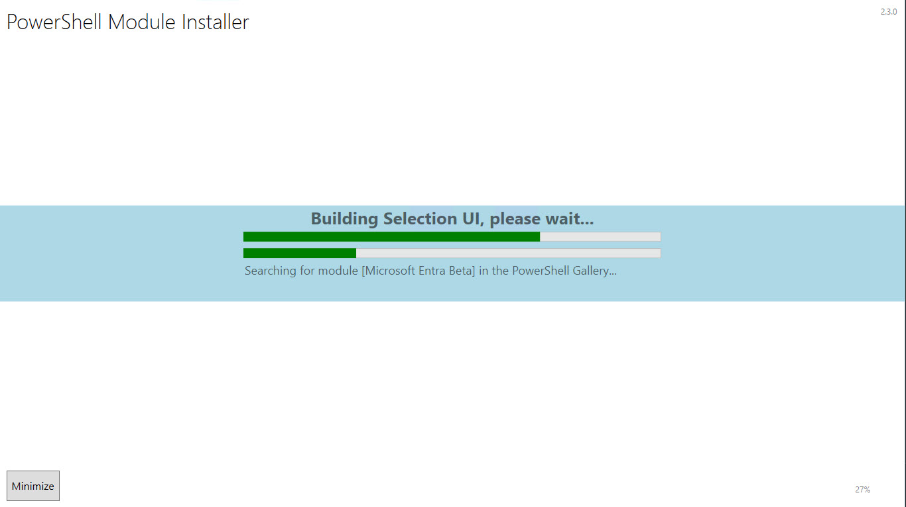
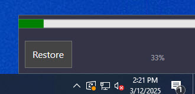
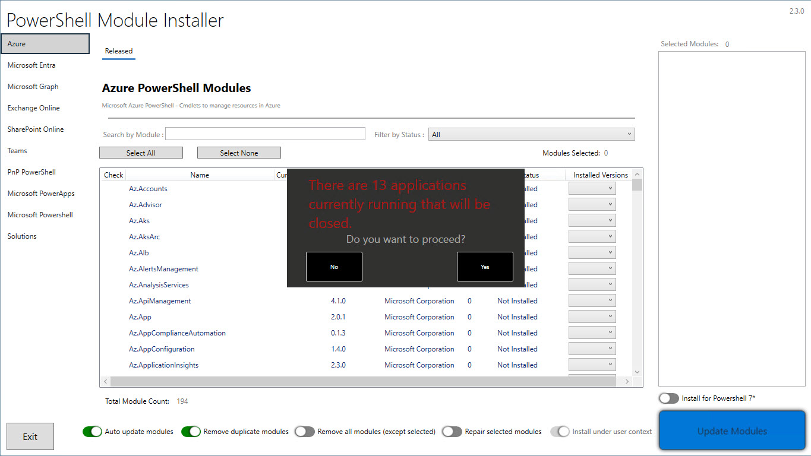

# PSModuleInstallerUI

A UI that can maintain PowerShell modules on a device.

## How to Use

To run the UI, execute the following command in PowerShell:

```powershell
PS> .\PowerShellModuleInstallerUI2.ps1
```

### Initial Run

When you run the UI for the first time, it will build a list of modules and export them based on the `UIConfig.json` file. The exported data will be saved in the following files:

- `ExportedModuleData.xml`
- `ExportedSolutionData.xml`

On subsequent runs, the UI will use these exported files for faster launch times. If you are deploying the package via Intune or ConfigMgr, you can include these files. However, you must maintain these files regularly by rerunning the UI with the following command:

```powershell
PS> .\PowerShellModuleInstallerUI2.ps1 -ForceNewModuleData -ForceNewSolutionData
```

### Recommended Command for Packaged App

For a packaged app, it is recommended to run the following commands:

For Install:
```cmd
C:\Windows\System32\WindowsPowerShell\v1.0\powershell.exe -NoProfile -ExecutionPolicy Bypass -WindowStyle Hidden -File .\PowerShellModuleInstallerUI2.ps1 -StoredDataPath "C:\ProgramData\Company\PSModuleInstallerData" -LogFilePath "C:\ProgramData\Company" -TagDetectionPath "C:\ProgramData\Company"
```

For uninstall
```cmd
C:\Windows\System32\WindowsPowerShell\v1.0\powershell.exe -NoProfile -ExecutionPolicy Bypass -WindowsStyle Hidden -File .\Uninstall.ps1 TagName "PowerShellModuleInstaller" -TagVersion "2.3.0" -TagDetectionPath "C:\ProgramData\Company"
```

For Detection (update variables in script)
```powershell
.\DetectionTag.ps1
```

> [!IMPORTANT]
> The commands above are for _USER CONTEXT_ only! If you deploy this UI using _SYSTEM CONTEXT_, you must use the _ServiceUI_x64.exe_

```cmd
ServiceUI_x64.exe -process:explorer.exe C:\Windows\System32\WindowsPowerShell\v1.0\powershell.exe -NoProfile -ExecutionPolicy Bypass -WindowStyle Hidden -File .\PowerShellModuleInstallerUI2.ps1 -StoredDataPath "C:\ProgramData\Company\PSModuleInstallerData" -LogFilePath "C:\ProgramData\Company" -TagDetectionPath "C:\ProgramData\Company"
```

## Why use this?

This UI is designed for environments that want to "control" what modules are available to download. It also provides an easy means of updating modules.

### Intune Managed Installer

Using Intune Managed Installer with this UI, you can ensure that only approved PowerShell modules are installed on your devices. This helps maintain a secure and compliant environment by preventing unauthorized modules from being installed. The UI allows you to manage and update these modules easily, ensuring that your devices always have the latest approved versions.

### Windows Defender Application Control (WDAC)

Windows Defender Application Control (WDAC) helps protect your devices by allowing only trusted applications to run. By using this UI in conjunction with WDAC, you can control which PowerShell modules are allowed to run on your devices. This adds an extra layer of security by ensuring that only approved modules are executed, reducing the risk of running malicious or untrusted code.

By leveraging this UI as an app while using Intune Managed Installer and WDAC, you can maintain a secure environment for managing PowerShell modules, ensuring compliance and reducing the risk of security threats. This integration also ensures that the modules will run correctly on the device, providing a reliable and consistent experience for users.

## Parameters

The script accepts the following parameters:

- `-StoredDataPath` [string]: Specifies the path where data is stored; default is `"$env:Temp"`
- `-TagDetectionPath` [string]: Specifies the path for tag detection; default is `"$env:ALLUSERSPROFILE"`.
- `-LogFilePath` [string]: Specifies the path for the log file; default is `"$env:Temp"`
- `-ForceNewModuleData` [switch]: Forces the creation of new module data.
- `-ForceNewSolutionData` [switch]: Forces the creation of new solution data.
- `-SkipSolutionData` [switch]: Skips the processing of solution data.
- `-SimulateInstall` [switch]: Simulates the installation process without making any changes (sets Whatif)
- `-ExportUIData` [switch]: Exports UI data as PSObject XML. Can be used for troublehshooting

## UIConfig

The `UIConfig.json` file controls how the UI is displayed. It consists of three main sections:

### DefaultSettings

This section determines the default settings for the UI:

- `PowerShellVersion`: Specifies the PowerShell version to use (e.g., 5.1).
- `AutoUpdate`: Enables or disables automatic updates for all modules installed; **not just what is selected** (True/False).
- `RemoveDuplicates`: Removes duplicate modules for all modules installed; **not just what is selected** (True/False).
- `RemoveAllModulesFirst`: Removes all modules before installing new ones (True/False).
- `AllowUserContextInstall`: Allows installation in the user context (True/False).
- `InstallMode`: Specifies the installation mode (e.g., CurrentUser).
- `UseExternalInstaller`: Uses an external installer if available (True/False).
- `IgnorePoshProcessCheck`: Ignore any processes identified to use powershell modules (eg: code, ise, powershell, pwsh) (True/False).

>TIP: By selecting _Remove all modules_, unselecting all other options, and choosing installed modules (use the _filter by status_), will remove the modules selected!

### ModuleGroups

This section defines groups of modules that can be managed together. Each group can have its own settings and behavior. The key names in this section are:

- `Name`: The name of the module group.
- `Description`: A description of the module group.
- `PowerShellVersionSupport`: An array of supported PowerShell versions.
- `ModuleSearch`: A search pattern to find modules. This can be a string or array. User \* to search wildcard 
- `ModuleAuthors`: An array of authors of the modules.
- `ModuleVersion`: An array of specific module versions.
- `IncludePrereleaseVersion`: A boolean indicating whether to include prerelease versions.(this feature is not avaialble yet)
- `ShowBetaTab`: A boolean indicating whether to show a beta tab.
- `IncludedModules`: An array of included modules.
- `ExcludedModules`: An array of excluded modules.

### SolutionGroupedModules

This section defines groups of modules that are part of a solution. These groups can be managed together as part of a larger solution. The key names in this section are:

- `Name`: The name of the solution group.
- `ModulesListUrl`: A URL to a list of modules.
- `ModulesQuery`: A query to filter the modules.
- `Description`: A description of the solution group.
- `PowerShellVersionSupport`: An array of supported PowerShell versions.
- `IncludedModules`: An array of included modules.
- `ExcludedModules`: An array of excluded modules.
- `AdditionalDownloads`: An array of additional downloads required for the solution group. Each download can have the following keys:
  - `Name`: The name of the download.
  - `Type`: The type of the download (e.g., File, msix).
  - `Required`: A boolean indicating whether the download is required.
  - `OnlineDownload`: A boolean indicating whether the download is available online.
  - `DownloadUrl`: The URL to download the file.
  - `DestinationPath`: The path where the file should be saved.
  - `InstallArgument`: Any arguments required for installation.
  - `Description`: A description of the download.

## Screenshots

Here are some screenshots of the PSModuleInstallerUI:









## Troubleshoting

There are three global variables that can be used to identify UI issues. 

```powershell
$Global:UI.Error
$Global:BuildSequence.Error
$Global:InstallSequence.Error
```

If your running the script via Intune/MECM, Use the ExportUIData switch to export the CLIXML, then when complete you can run

```powershell
#EXAMPLE
#change date to current
$UI = Import-CliXml -Path "$env:temp\PowerShellModuleManager_2025-05-20_T09-56-16-AM_UIData.xml"
$UI.Error
```


If you have any issues, please submit them. 
