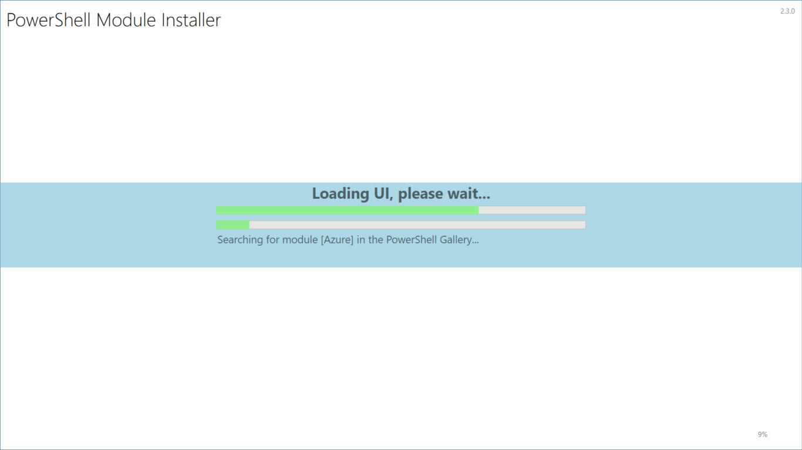
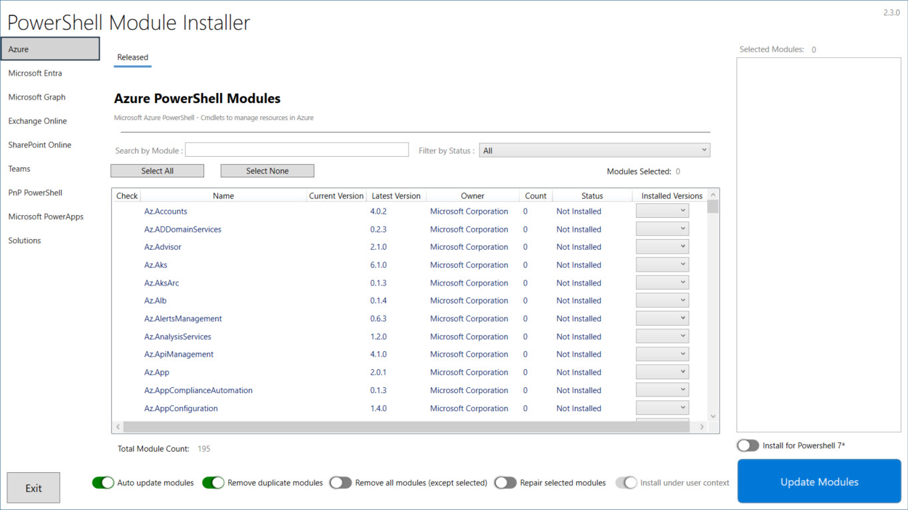
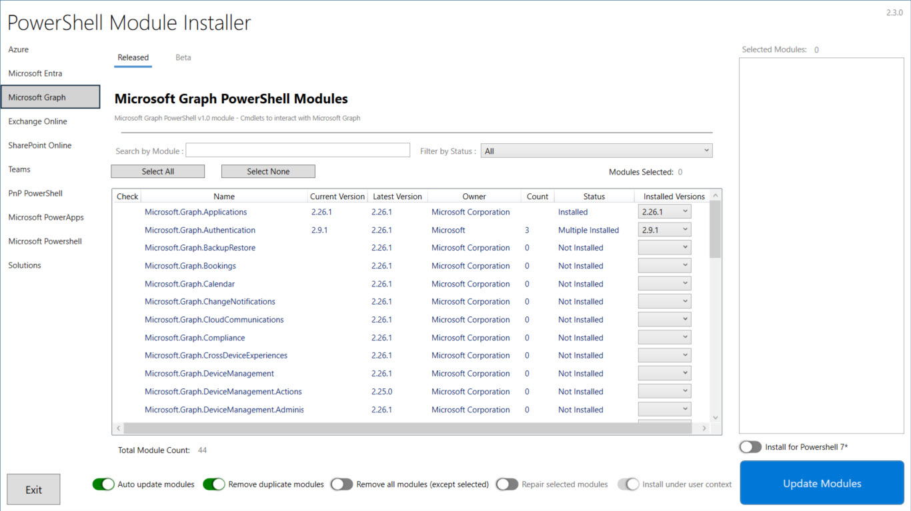
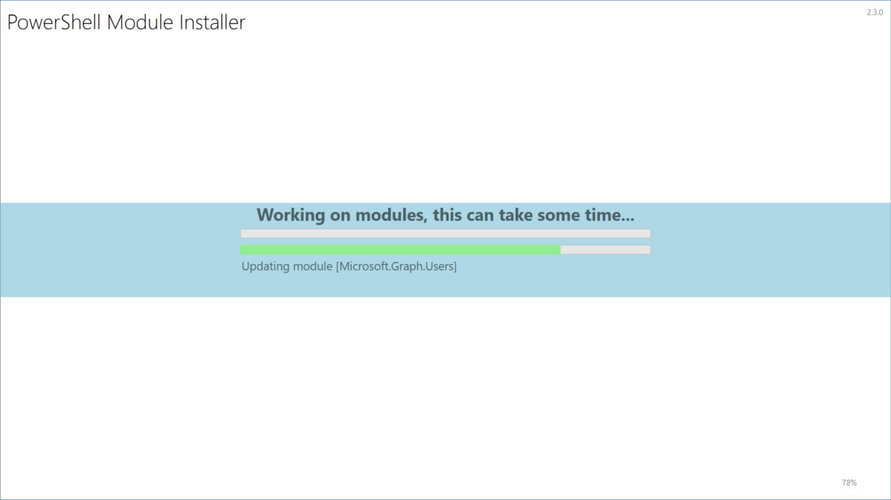
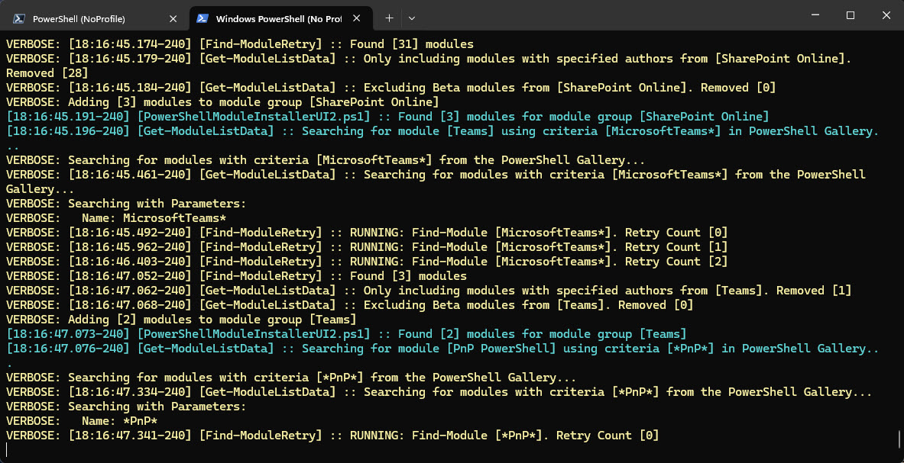

# PSModuleInstallerUI

A UI that can maintain PowerShell modules on a device.

## How to Use

To run the UI, execute the following command in PowerShell:

```powershell
PS> .\PowerShellModuleInstallerUI2.ps1
```

### Initial Run

When you run the UI for the first time, it will build a list of modules and export them based on the `UIConfig.json` file. The exported data will be saved in the following files:

- `ExportedModuleData.xml`
- `ExportedSolutionData.xml`

On subsequent runs, the UI will use these exported files for faster launch times. If you are deploying the package via Intune or ConfigMgr, you can include these files. However, you must maintain these files regularly by rerunning the UI with the following command:

```powershell
PS> .\PowerShellModuleInstallerUI2.ps1 -ForceNewModuleData -ForceNewSolutionData
```

### Recommended Command for Packaged App

For a packaged app, it is recommended to run the following command:

```powershell
PS> .\PowerShellModuleInstallerUI2.ps1 -SolutionDataPath "C:\ProgramData\Company" -LogFilePath "C:\ProgramData\Company" -TagDetectionPath "C:\ProgramData\Company
```

## Parameters

The script accepts the following parameters:

- `-StoredDataPath` [string]: Specifies the path where data is stored.
- `-TagDetectionPath` [string]: Specifies the path for tag detection, default is `"$env:ALLUSERSPROFILE\Company"`.
- `-LogFilePath` [string]: Specifies the path for the log file.
- `-ForceNewModuleData` [switch]: Forces the creation of new module data.
- `-ForceNewSolutionData` [switch]: Forces the creation of new solution data.
- `-SkipSolutionData` [switch]: Skips the processing of solution data.
- `-SimulateInstall` [switch]: Simulates the installation process without making any changes.

## UIConfig

The `UIConfig.json` file controls how the UI is displayed. It consists of three main sections:

### DefaultSettings

This section determines the default settings for the UI:

- `PowerShellVersion`: Specifies the PowerShell version to use (e.g., 5.1).
- `AutoUpdate`: Enables or disables automatic updates (True/False).
- `RemoveDuplicates`: Removes duplicate modules (True/False).
- `RemoveAllModulesFirst`: Removes all modules before installing new ones (True/False).
- `AllowUserContextInstall`: Allows installation in the user context (True/False).
- `InstallMode`: Specifies the installation mode (e.g., CurrentUser).
- `UseExternalInstaller`: Uses an external installer if available (True/False).
- `IgnorePoshProcessCheck`: Ignore any processes identified to use powershell modules (eg: code, ise, powershell, pwsh) (True/False).

### ModuleGroups

This section defines groups of modules that can be managed together. Each group can have its own settings and behavior. The key names in this section are:

- `Name`: The name of the module group.
- `Description`: A description of the module group.
- `PowerShellVersionSupport`: An array of supported PowerShell versions.
- `ModuleSearch`: A search pattern to find modules.
- `ModuleAuthors`: An array of authors of the modules.
- `ModuleVersion`: An array of specific module versions.
- `IncludePrereleaseVersion`: A boolean indicating whether to include prerelease versions.
- `ShowBetaTab`: A boolean indicating whether to show a beta tab.
- `IncludedModules`: An array of included modules.
- `ExcludedModules`: An array of excluded modules.

### SolutionGroupedModules

This section defines groups of modules that are part of a solution. These groups can be managed together as part of a larger solution. The key names in this section are:

- `Name`: The name of the solution group.
- `ModulesListUrl`: A URL to a list of modules.
- `ModulesQuery`: A query to filter the modules.
- `Description`: A description of the solution group.
- `PowerShellVersionSupport`: An array of supported PowerShell versions.
- `IncludedModules`: An array of included modules.
- `ExcludedModules`: An array of excluded modules.
- `AdditionalDownloads`: An array of additional downloads required for the solution group. Each download can have the following keys:
  - `Name`: The name of the download.
  - `Type`: The type of the download (e.g., File, msix).
  - `Required`: A boolean indicating whether the download is required.
  - `OnlineDownload`: A boolean indicating whether the download is available online.
  - `DownloadUrl`: The URL to download the file.
  - `DestinationPath`: The path where the file should be saved.
  - `InstallArgument`: Any arguments required for installation.
  - `Description`: A description of the download.

## Screenshots

Here are some screenshots of the PSModuleInstallerUI:











